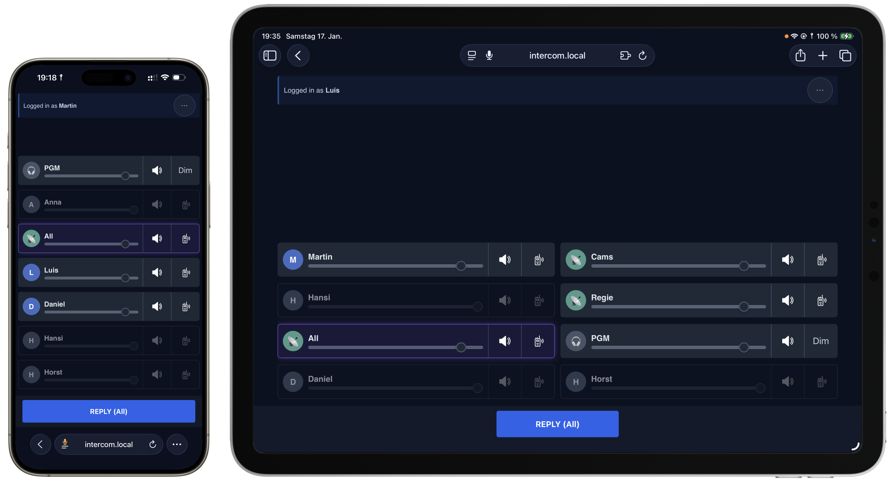

# Talk To Me
A local WebRTC Intercom app built with Node.js and mediasoup.
<br>
<br>


## What it does
- Web client with per-target and conference talk buttons, reply, and “talk lock”.
- Button control via Keyboard shortcuts, [Bitfocus Companion module](https://github.com/bitfocus/companion-module-talktome-intercom.git) and HTTP API
- Admin UI to manage users, conferences, feeds, and target order.
- Tally for camera operators via [Bitfocus Companion module](https://github.com/bitfocus/companion-module-talktome-intercom.git) and HTTP API.
- Feeds for program audio injection (experimental).

## Quick start

Choose one of these three ways to run Talk To Me:
- Download a prebuilt executable (macOS / Windows) from GitHub Releases
- Run the published Docker image
- Build and run from source

### Docker:
Replace `<HOST-IP>` below with the IP address that other devices use to reach this machine.

Use one of these two options:

Option A: if your Docker setup supports `--network host`, use this simpler command:
```bash
docker pull thepoison606/talktome:latest
docker run -d --restart unless-stopped --name talktome --network host -e PUBLIC_IP=<HOST-IP> -v talktome_data:/data thepoison606/talktome:latest
```
Then open `https://<HOST-IP>:8443` in the browser.

Option B: if you do not use `--network host`, publish the HTTPS, HTTP, and mediasoup RTC ports explicitly:
```bash
docker run -d --restart unless-stopped --name talktome -e PUBLIC_IP=<HOST-IP> -p 8443:8443 -p 8080:8080 -p 40000-49999:40000-49999/udp -p 40000-49999:40000-49999/tcp -v talktome_data:/data thepoison606/talktome:latest
```
Make sure the host firewall or any cloud/network security rules allow inbound traffic to the published ports. At minimum, `8443/tcp` must be reachable for the web UI, and mediasoup audio requires the RTC range `40000-49999` (`udp`, and optionally `tcp`) to be reachable from clients.
- Logs: `docker logs -f talktome`
- Stop: `docker stop talktome`

### Run from source:
Prerequisites: **Node.js 18+** (with `npm`) and a build toolchain for mediasoup.
- macOS: `xcode-select --install`
- Debian/Ubuntu: `sudo apt install build-essential python3 make`

```bash
git clone https://github.com/thepoison606/talktome.git
cd talktome
npm install
node server.js            # defaults to Port 443
```
Visit `https://localhost:443/` (accept the self-signed cert warning) or `https://<IP>:<PORT>/`.
- Admin UI: `/admin` (redirects to `/admin.html`)

Ports:
- Override with `PORT=8443 node server.js` (or `HTTPS_PORT`) or `node server.js 8080`.
- HTTP redirect listener defaults to port 80 when mDNS is on; change via `HTTP_PORT=8080` or disable with `HTTP_PORT=off`.
- mDNS hostname defaults to `intercom.local`; override with `MDNS_HOST=myalias.local`.
- For internet hosting, set `PUBLIC_IP=<your.public.ip>` so mediasoup announces the correct address.
- mediasoup uses RTC ports `40000-49999` (UDP and, if needed, TCP). Open them on your firewall/router for external clients (be careful!).

TLS:
- If no certificate exists yet, the server generates a self-signed pair in `certs/` inside the app data directory (`TALKTOME_DATA_DIR` or the default per-user data path).

Data:
- All state lives in `app.db` (SQLite) stored in the per-user app data directory:
  - macOS: `~/Library/Application Support/talktome/app.db`
  - Windows: `%LOCALAPPDATA%\\talktome\\app.db`
  - Linux: `$XDG_DATA_HOME/talktome/app.db` (fallback: `~/.local/share/talktome/app.db`)
  - Override with `TALKTOME_DATA_DIR`.
  Back it up before upgrades if you need to preserve accounts and routing.

## Configuration
On first interactive start, the server asks for:
- HTTPS port
- mDNS hostname (use `off` to disable)
- Media network for WebRTC
  - `Automatic`
  - `Preferred network adapter`
  - `Manual announced IP / hostname`

The answers are saved to `config.json` in the per-user app data directory:
- macOS: `~/Library/Application Support/talktome/config.json`
- Windows: `%LOCALAPPDATA%\\talktome\\config.json`
- Linux: `$XDG_DATA_HOME/talktome/config.json` (fallback: `~/.local/share/talktome/config.json`)
Environment variables still override the config.
- `PUBLIC_IP` forces a manual announced address.
- `TALKTOME_MEDIA_INTERFACE` forces a specific network adapter.
Delete `config.json` to re-run the setup.

You can also change the saved media network later in the Admin UI under `Config`.
Changing the media network requires a server restart before new WebRTC transports use it.


## Admin accounts & passwords
- On first boot, a superadmin `admin` user is auto-created with password `admin` and the flag `admin_must_change=1`.
- First admin login happens at `/admin`; the UI enforces a password change before access is granted.
- Admin sessions are stored as an httpOnly cookie (`admin_session`) with a 12h TTL.
- Superadmins cannot be demoted; admin accounts cannot be deleted.
- Create additional admins in the Admin UI; they share the same login page as operators.

## Using the app
- Operators and feeds log in on `/`.
- Admins use `/admin.html` to create users/conferences/feeds and assign talk targets.
- Feeds appear as a third target category with volume sliders and mute controls; they cannot be used as talk targets.

## Camera tally
Post when a user’s camera is on-air; their UI background turns red.
- **URL:** `https://<IP-ADDRESS>:<PORT>/cut-camera`
- **Method:** `POST`
- **Headers:** `Content-Type: application/json`
- **Body:**
  ```json
  { "user": "<USERNAME>" }
  ```

## Companion API (v1)


Companion module source is maintained in a separate standalone repository.

Authentication:
- API key auth:
  - Header `x-api-key: <API_KEY>` or `Authorization: Bearer <API_KEY>`
- Key source:
  - Env var: `COMPANION_API_KEY`
  - Or generated file in app data dir: `companion_api_key`
  - Admin retrieval endpoint: `GET /admin/api-key`
- User login auth (session token):
  - `POST /api/v1/companion/auth/login` with `{ "name": "...", "password": "..." }`
  - Use returned token as `Authorization: Bearer <SESSION_TOKEN>`
  - Scope:
    - non-superadmin users can control only their own operator user id
    - superadmin users keep full access

Core endpoints:
- `POST /api/v1/companion/auth/login`
- `GET /api/v1/companion/config`
- `GET /api/v1/companion/state` (full snapshot)
- `GET /api/v1/companion/users`
- `GET /api/v1/companion/conferences`
- `GET /api/v1/companion/feeds`
- `GET /api/v1/companion/users/:id/targets`
- `POST /api/v1/companion/users/:id/talk` (command + ack/result)
- `POST /api/v1/companion/users/:id/target-audio` (mute/volume for user, conference, or feed targets)

Legacy endpoint:
- `POST /users/:id/talk`

Live events (Socket.IO):
- Namespace: `/companion`
- Events:
  - `snapshot`
  - `user-state`
  - `command-result`
  - `cut-camera`

Command body:
```json
{
  "action": "press",
  "targetType": "conference",
  "targetId": 12,
  "waitMs": 1500
}
```

Example:
```bash
curl -X POST https://localhost/api/v1/companion/users/8/talk \
  -H "Content-Type: application/json" \
  -H "x-api-key: <API_KEY>" \
  -d '{"action":"press","targetType":"conference","targetId":3}'
```

Keyboard Shortcuts:
- Space bar: Reply to last received target.
- Number keys: Talk to targets in list order.
