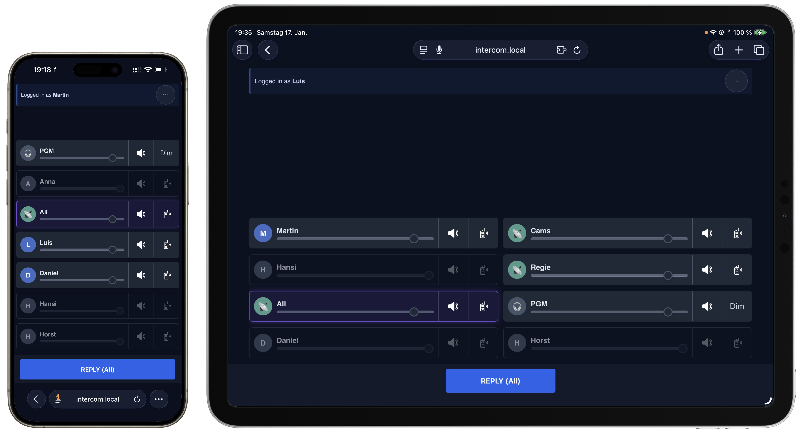

# Talktome

Local WebRTC intercom app built with Node.js, mediasoup and Socket.IO.



## Features

- Browser-based intercom with direct targets, conferences, reply and talk lock.
- Admin UI for users, feeds, conferences, target order, network config, RTC port range, backups and Guest login.
- Program-audio feeds with volume and mute controls.
- Camera tally and remote control through Bitfocus Companion, HTTP API, module and keyboard shortcuts.
- Bridge Desktop Application to integrate NDI, OMT, hardware intercom systems, audio interfaces and mixing consoles.
- Optional multiple-production matrices with scoped users, conferences, feeds and production admins.

## Quick Start

Choose one way to run the application:

- **[macOS / Windows release](https://github.com/thepoison606/talktome/releases)** easiest local install
- **[Docker](https://hub.docker.com/r/thepoison606/talktome)**
- **Source:** for development

The macOS and Windows releases contain the Talktome server installer and the
optional Talktome Bridge app.

### First Start

1. Start Talktome and open the shown HTTPS URL, for example `https://<HOST-IP>/` or `https://<HOST-IP>:8443/` depending on your selected HTTPS port.
2. Accept the browser warning for the self-signed local certificate.
3. Open `/admin` on the same HTTPS URL.
4. Log in with the initial admin account:
   - Username: `admin`
   - Password: `talktom3`
5. Change the admin password when prompted.
6. In Admin, create users, feeds and conferences, then assign targets to the users who should talk to each other.
7. Operators log in at `/` with their user credentials and allow microphone access.

If clients can open the page but audio does not connect, check Admin `Config`,
the announced media address and the RTC port range/firewall rules.

For WAN use, the announced media address must resolve directly to the Talktome
server and the configured RTC UDP range must be forwarded to it. The native
Bridge opens its return-audio NAT mapping automatically; it does not require a
fixed inbound port or a Bridge-side port-forwarding rule.

### Docker

Replace `<HOST-IP>` with the LAN address clients use to reach this host.

Host networking:
```bash
docker pull thepoison606/talktome:latest
docker run -d --restart unless-stopped --name talktome \
  --network host \
  -e PUBLIC_IP=<HOST-IP> \
  -v talktome_data:/data \
  thepoison606/talktome:latest
```

Explicit port publishing:
```bash
docker run -d --restart unless-stopped --name talktome \
  -e PUBLIC_IP=<HOST-IP> \
  -p 8443:8443 -p 8080:8080 \
  -p 40000-49999:40000-49999/udp \
  -p 40000-49999:40000-49999/tcp \
  -v talktome_data:/data \
  thepoison606/talktome:latest
```

Open `https://<HOST-IP>:8443/`. Allow the HTTPS port and the configured RTC port range in your firewall.
The Admin `Config` page can restart the server. Docker deployments use their
configured restart policy (as in the examples above).

### macOS Test Builds

Unsigned macOS test builds downloaded from GitHub may be blocked by Gatekeeper.
To remove the quarantine flag once after installing or extracting:

```bash
xattr -dr com.apple.quarantine "/Applications/Talktome Server.app"
xattr -dr com.apple.quarantine "/Applications/Talktome Bridge.app"
```

Use the first command for the Talktome server app and the second command for the
native Bridge app.

### Versioning and releases

Git release tags are the single source of truth for every Server, Bridge and
Docker build. Create a tag such as `v1.2.5` to produce version `1.2.5`; commits
after the latest tag receive a development version such as `1.2.5-dev.3`.
Package, Cargo and Tauri manifests intentionally contain only the neutral
`0.0.0` placeholder and must not be edited for a release. The shared
`scripts/resolve-build-version.js` resolver supplies the version to local and
GitHub builds.

## Configuration

On first interactive start, Talktome creates `config.json` and asks for:

- HTTPS port
- mDNS hostname, or `off`
- RTC port range: start port and number of ports
- WebRTC media network mode: automatic (all usable adapters), preferred adapter, or manual announced IP/hostname

The same settings can be changed later in Admin `Config`.

In automatic media-network mode, Talktome offers every usable non-internal
IPv4 adapter as a WebRTC ICE candidate. Clients on different attached networks
can therefore select the server address they can reach and communicate through
the same Talktome router. Link-local addresses are only used as a fallback when
no regular adapter address is available. Preferred-adapter and manual modes
remain single-address modes for deterministic or NAT-facing deployments.

Useful environment overrides:

- `PORT` / `HTTPS_PORT`: HTTPS UI port
- `HTTP_PORT`: redirect port, or `off`
- `PUBLIC_IP`: manual WebRTC announced address
- `MDNS_HOST`: mDNS hostname, or `off`
- `TALKTOME_MEDIA_INTERFACE`: preferred network adapter
- `TALKTOME_MEDIA_INTERNAL_IP`: optional bindable LAN address advertised in addition to `PUBLIC_IP`
- `TALKTOME_RTC_PORT_START` and `TALKTOME_RTC_PORT_COUNT`: RTC range override
- `TALKTOME_ICE_SERVERS_JSON`: browser STUN/TURN servers as standard `RTCIceServer` JSON
- `TALKTOME_ICE_TRANSPORT_POLICY`: browser ICE policy, `all` (default) or `relay`
- `TALKTOME_TURN_URLS`, `TALKTOME_TURN_USERNAME` and `TALKTOME_TURN_CREDENTIAL`: simple TURN-only alternative to the JSON setting
- `TALKTOME_DATA_DIR`: data directory override
- `TALKTOME_SSO_ENABLED`: enable trusted reverse-proxy header SSO (`true`, default: disabled)
- `TALKTOME_SSO_HEADER`: identity header set by the proxy (default: `X-Forwarded-User`)
- `TALKTOME_SSO_TRUSTED_PROXIES`: required comma-separated proxy IP/CIDR allowlist when SSO is enabled
- `COMPANION_API_KEY`: fixed Companion/API key

Changing media-network, RTC-port, browser ICE or SSO environment settings requires a server restart. Guest login changes apply immediately.

## Data

State is stored in SQLite `app.db`; config, certificates and generated API keys live in the same app data directory.

- macOS: `~/Library/Application Support/talktome`
- Windows: `%LOCALAPPDATA%\talktome`
- Linux: `$XDG_DATA_HOME/talktome` or `~/.local/share/talktome`
- Override: `TALKTOME_DATA_DIR=/path/to/data`

Back up this directory before upgrades if you need to preserve accounts and routing.

Admin → Config → Backup and restore can also write automatic JSON configuration backups to the `backups` subdirectory of this app data directory. This is off by default; choose an interval of 1, 3, 7, 14 or 30 days. Enabling it creates the first backup immediately. Backups are retained until you remove them.


## Users, Feeds And Guests

- Operators log in at `/` and can talk to assigned users/conferences.
- Feeds log in at `/`, publish their assigned feed, and cannot talk back.
- Guests are enabled in Admin `Config`.
- All Guests share the targets and conference memberships of the generated `Guest` profile.
- The Guest profile in Admin `Users` provides a shareable login URL and QR code; Guests still choose their own display name when opening it.
- Guest profiles cannot be direct targets, admins, deleted, or password-reset.
- Online Guests can still be answered through `Reply`.
- Guest login is passwordless and stored only in browser `sessionStorage`, so page refresh keeps it, but closing the browser session clears it.

## Trusted reverse-proxy SSO

The first SSO integration stage supports an authentication proxy such as
Traefik ForwardAuth or oauth2-proxy. It is disabled by default. To enable it:

```text
TALKTOME_SSO_ENABLED=true
TALKTOME_SSO_HEADER=X-Forwarded-User
TALKTOME_SSO_TRUSTED_PROXIES=172.18.0.0/16,127.0.0.1
```

The proxy-provided identity is matched exactly and case-sensitively against an
existing Talktome username. Talktome does not provision users automatically.
Unknown identities, Guest profiles and Super Admins fall back to the normal
login page. Because the username is the chosen mapping key, renaming it in
Talktome or changing the upstream identity breaks the mapping until both values
match again.

Only direct connections from `TALKTOME_SSO_TRUSTED_PROXIES` may supply the
identity header. The Talktome backend must not be directly reachable by clients,
and the reverse proxy must replace or remove any client-supplied copy of the
configured header. Browser and Socket.IO registrations are backed by the same
HttpOnly server session; a client cannot select a different user ID locally.

SSO applies to operator login at `/`. Feeds, Guests, Admin, Companion and Bridge
retain their existing authentication paths. Browser sessions are held in memory
for 12 hours and are invalidated by a server restart; with SSO, the next page
load creates a new session automatically. Logging out of Talktome does not end
the upstream identity-provider session, so a reload can sign the user in again.

## Matrix and Productions

The Admin `Matrix` page always contains the existing `Default` target and
conference-membership matrices. Conference membership automatically provides
the matching conference target button, so it does not need to be assigned a
second time.

Enable `Multiple Productions` on that page to add separate Production layouts.
Each Production explicitly contains users, conferences and feeds and has its own
conference memberships, target assignments and button order. Users assigned to
one or more Productions can choose one of their assigned Productions after login
and can switch from the application menu. A missing selection falls back to an
actual membership; users without any Production receive a clear assignment error.

Conference identities remain global and may span Productions. Routing uses each
connected user's currently loaded Production: speaking to a conference reaches
all active users whose current Default or Production membership includes that
conference, even when those users loaded different Productions. A user has only
one active Talktome session at a time.

Production admins may manage the contents, memberships and matrix of their own
Productions without access to global users, server config, backups or other
Productions. Only global admins may enable the feature, create, rename or delete
Productions, or assign Production admins. Bridge endpoints, Bridge feeds and
personal mute/volume settings remain global and do not select a Production.

## Companion and HTTP API

Companion module source is maintained separately:
`https://github.com/bitfocus/companion-module-talktome-intercom.git`

Auth:

- API key via `x-api-key: <KEY>` or `Authorization: Bearer <KEY>`
- User-scoped token via `POST /api/v1/companion/auth/login`

Main endpoints:

- `GET /api/v1/companion/config`
- `GET /api/v1/companion/state`
- `GET /api/v1/companion/users`
- `GET /api/v1/companion/conferences`
- `GET /api/v1/companion/feeds`
- `GET /api/v1/companion/users/:id/targets`
- `POST /api/v1/companion/users/:id/talk`
- `POST /api/v1/companion/users/:id/target-audio`
- Legacy: `POST /users/:id/talk`

Production-aware Companion clients receive the available Productions in the
login/config response. Pass `productionId` as a query parameter to the state,
users, conferences, feeds and targets endpoints, and as Socket.IO auth data for
a filtered snapshot and event stream. Omitting it selects the primary Production;
when Multiple Productions is disabled, an explicitly supplied value is ignored.

Socket.IO namespace: `/companion` with `snapshot`, `user-state`, `command-result`, and `cut-camera` events.

Guest profiles are intentionally hidden from Companion and cannot be controlled as direct targets.

### Enabling SSO

To use SSO, configure the authentication proxy to remove any client-supplied
copy of the identity header and, after successful authentication, set
`X-Forwarded-User` (or the header selected with `TALKTOME_SSO_HEADER`) to the
exact, case-sensitive name of an existing Talktome user. Enable SSO with
`TALKTOME_SSO_ENABLED=true`, add the proxy IP or network to
`TALKTOME_SSO_TRUSTED_PROXIES`, and ensure clients cannot reach the Talktome
backend without passing through that proxy. No user synchronization or
automatic provisioning is required; unknown identities see the normal login
page.

## Camera Tally

```bash
curl -X POST https://<IP>:<PORT>/cut-camera \
  -H "Content-Type: application/json" \
  -d '{"user":"<USERNAME>","bus":"pgm","productionId":1}'
```

`pgm` turns the matching user UI red and `prv` turns it green. Tally is scoped to
the selected Production. Omit `bus` for the legacy PGM behavior; omit
`productionId` to use the primary Production. Send an empty `user` to clear the
selected bus. The legacy `cutCameraUser` snapshot field remains available for PGM.

## Shortcuts

- `Space`: Reply
- Number keys: talk to targets in list order
- Set your own hotkeys in the menu

## Native Bridge App

Talktome Bridge is the optional macOS/Windows tray app for connecting local
audio interfaces such as Dante Virtual Soundcard, NDI, OMT and other
CoreAudio/WASAPI devices. Developer and packaging notes live in
`bridge-client/README.md`.

The Bridge also supports NDI® Audio without bundling proprietary NDI
software. Install the current [NDI Runtime](https://ndi.video/for-developers/) for this feature. Discovered NDI
sources then appear as input devices, while `Talktome Bridge 1` through
`Talktome Bridge 8` appear as stereo NDI output devices. Select them for a
managed Bridge port exactly like a local audio interface. The initial
implementation accepts uncompressed 48 kHz floating-point NDI audio; NDI HX and
compressed Advanced SDK audio are not supported. The runtime can alternatively
be selected explicitly with `TALKTOME_NDI_RUNTIME=/path/to/libndi`.

NDI® is a registered trademark of Vizrt NDI AB. Talktome does not distribute
the NDI SDK, NDI Runtime or NDI Tools; installing the runtime is subject to
NDI's own license terms.

The Bridge also includes royalty-free Open Media Transport (OMT) Audio support.
No separate runtime is required. Discovered OMT sources can be selected as
Bridge inputs, and eight `Talktome Bridge N` stereo OMT send slots are available
as outputs. OBS 31 or newer can send and receive them using the official
[OMT plugin](https://github.com/openmediatransport/omtplugin). Setup and network
requirements are documented in the Bridge client's
[OMT Audio documentation](bridge-client/README.md#omt-audio).

## Radio Gateway Prototype

The repository includes a generic hardware gateway helper for bridging Talktome to an external radio or intercom device. It expects a Linux gateway host with ALSA audio I/O, an audio interface connected to the external device, and an optional GPIO-controlled PTT circuit.

The helper can control PTT through `pinctrl`, monitor receive audio level, and stream bidirectional audio between the external device and a Talktome conference.

Commands:

```bash
npm run radio:ptt -- 2
npm run radio:play -- test.wav
npm run radio:monitor
npm run radio:record
npm run radio:calibrate
TALKTOME_SERVER_URL=https://<SERVER-IP>:8443 TALKTOME_GATEWAY_API_KEY=<COMPANION-API-KEY> TALKTOME_GATEWAY_USER_ID=<USER-ID> TALKTOME_GATEWAY_CONFERENCE_ID=<CONFERENCE-ID> npm run radio:stream
```

Run `npm run radio:calibrate` on the gateway host to measure idle noise, remote PTT without speech, and quiet speech. It writes `gateway/radio-config.json`; environment variables still override that file.

The streaming gateway authenticates with the Companion API key shown in the
Admin UI. Set it through `TALKTOME_GATEWAY_API_KEY` (or `COMPANION_API_KEY`)
before starting `radio:stream`.

Defaults can be configured in `gateway/radio-config.json` or overridden with environment variables:

```bash
TALKTOME_RADIO_CONFIG=gateway/radio-config.json
TALKTOME_RADIO_GPIO=17
TALKTOME_RADIO_AUDIO_DEVICE=plughw:CARD=CODEC,DEV=0
TALKTOME_RADIO_RX_ON_THRESHOLD=0.002
TALKTOME_RADIO_RX_OFF_THRESHOLD=0.003
TALKTOME_RADIO_RX_HANG_MS=600
TALKTOME_RADIO_RX_PRE_ROLL_MS=500
TALKTOME_RADIO_RX_RESUME_LEAD_MS=150
TALKTOME_RADIO_RX_WARMUP_MS=500
TALKTOME_RADIO_RX_GAIN_DB=6
TALKTOME_RADIO_TX_ENABLED=true
TALKTOME_RADIO_TX_RTP_IP=<auto-detected-gateway-ip>
TALKTOME_RADIO_TX_RTP_PORT=5006
TALKTOME_RADIO_TX_GAIN_DB=0
TALKTOME_RADIO_RX_SEGMENTS_DIR=gateway/rx-segments
TALKTOME_SERVER_URL=https://talktome.local:8443
TALKTOME_GATEWAY_API_KEY=<COMPANION-API-KEY>
TALKTOME_GATEWAY_USER_ID=1
TALKTOME_GATEWAY_CONFERENCE_ID=1
TALKTOME_GATEWAY_NAME=Radio Gateway
```

Sync gateway changes from a development machine to a gateway host without pushing to GitHub:

```bash
TALKTOME_GATEWAY_HOST=user@gateway-host.local npm run gateway:sync
```
